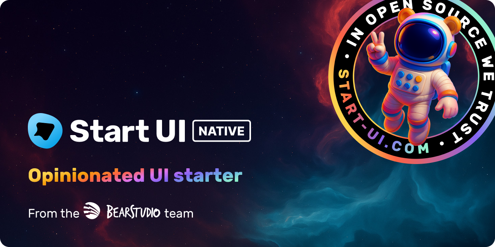

<h1 align="center"></h1>

🚀 Start UI <small>[native]</small> is an opinionated native starter repository created & maintained by the [BearStudio Team](https://www.bearstudio.fr/team) and other contributors.
It represents our team's up-to-date stack that we use when creating native apps for our clients.


# Technologies

[⚙️ Node.js](https://nodejs.org), [🟦 TypeScript](https://www.typescriptlang.org/), [⚛️ React](https://react.dev/), [📱 React Native](https://reactnative.dev/), [🚀 Expo](https://docs.expo.dev/), [🔐 Better Auth](https://www.better-auth.com/), [🌿 Ficus UI](https://ficus-ui.com/), [🌴 Tanstack Form](https://tanstack.com/form/), [🌴 Tanstack Query](https://tanstack.com/query/), [👋 Hey API](https://heyapi.dev/)

# Requirements

* [Node.js](https://nodejs.org) >= 22
* [pnpm](https://pnpm.io/)

# Getting Started

```bash
pnpm create start-ui -t native myApp
```

That will scaffold a new folder with the latest version of 🚀 Start UI <small>[native]</small> 🎉

# Installation

```bash
cp .env.example .env # Setup your env variables
cp .vscode/settings.example.json .vscode/settings.json  # (Optionnal) Setup your VS Code
pnpm install # Install dependencies
```

## Environment variables

🚨 Using Expo Go, local development urls should not be `localhost`, use public IP instead

```bash
EXPO_PUBLIC_BASE_URL # Base URL of your server, usefull if you are using Start UI [web]

# OPTIONAL TO OVERRIDE
EXPO_PUBLIC_AUTH_URL # Better-auth url (default `${EXPO_PUBLIC_BASE_URL}/api/auth`)
EXPO_PUBLIC_OPENAPI_URL # OpenAPI contract URL (default `${EXPO_PUBLIC_BASE_URL}/openapi/app/schema`)
```

## API SDK generation

```bash
pnpm gen:api
```

A new folder `/src/lib/hey-api/generated` will be created with stuff like to combine use Tanstack Query to fetch data, based on env variables.

For example
```ts
import { api } from '@/lib/hey-api/api';

useQuery(api.bookGetByIdOptions({ path: { id: props.bookId } }));
```

# Run


### Expo Go

```bash
pnpm dev
```

### Local build

```bash
pnpm prebuild     # To generate local builds

pnpm dev:ios      # To run with local ios build
pnpm dev:android  # To run with local android build
```

## Generate custom icons components from svg files

Put the custom svg files into the `app/components/icons/svg-sources` folder and then run the following command:

```bash
pnpm gen:icons
```

If you want to use the same set of custom duotone icons that Start UI is already using, checkout
[Phosphor](https://phosphoricons.com/)

> [!WARNING]
> All svg icons should be svg files prefixed by `icon-` (example: `icon-externel-link`) with **square size** and **filled with `#000` color** (will be replaced by `currentColor`).

# EAS Preview

To be able to use previews on PR, you have to setup your project with EAS

1. Setup Expo access token 
    * Create it: https://expo.dev/accounts/{account}/settings/access-tokens
    * Add it as GitHub repository secrets: https://github.com/xxx/xxx/settings/secrets/actions
2. Add GitHub repository variables: https://github.com/xxx/xxx/settings/variables/actions
    * `API_URL`
    * `AUTH_URL`
    * `OPENAPI_URL` 
3. Setup Expo project: https://expo.dev/
    * Create your project
    * Get project's id
    * Set as `EXPO_PROJECT_ID` in `app.config.ts`
4. Setup eas
    * `eas login`
    * `eas init --id {projectid}`
    * `eas update:configure`