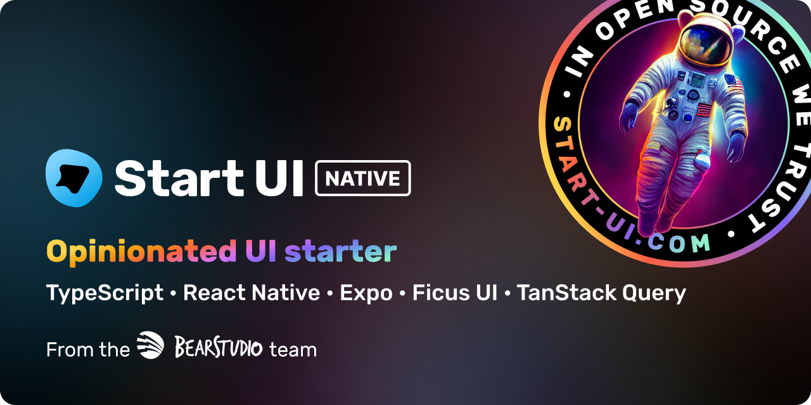

<h1 align="center"></h1>

🚀 Start UI [native] is a opinionated [Expo](https://expo.dev/) starter repository created & maintained by the [BearStudio Team](https://www.bearstudio.fr/team) and other contributors.
It represents our team's up-to-date stack that we use when creating React Native apps for our clients.

This starter is oriented to use Expo with Expo EAS features to have full access to native code.

StartUI [native] needs [StartUI web](https://github.com/BearStudio/start-ui-web) v2 as API in order to work correctly.  
Make sure to have a local/deployed installation of StartUI [web] v2 before using StartUI [native].

---

## Technology

- 🚀 [Expo SDK 51](https://expo.dev/)
- 📱 [Expo EAS](https://expo.dev/eas)
- ⚛️ [Expo Router 3](https://expo.github.io/router/docs/)
- 🌿 [Ficus UI](https://ficus-ui.com/)
- 🐜 [Formiz](https://formiz-react.com/)
- ↔ [Zodios](https://www.zodios.org/)

---

## Getting Started

### Prerequisites

This app is using Expo Go with [Expo development builds](https://docs.expo.dev/workflow/overview/#development-builds). In order to launch the app, you will need to install android and ios tooling:

#### Android

See https://reactnative.dev/docs/environment-setup?guide=native&platform=android

#### iOS

See https://reactnative.dev/docs/environment-setup?guide=native&platform=ios

### Update .env values

Put your env values on .env file. Environment variables inserted on your local machine or on Expo EAS platform will overwrite the variables of .env file.

```bash
# Env var used to call api endpoints — generally it will be your start-ui-web api url
API_URL='your api url here'

# Env var used to get the open api file, used to generate zodios client
OPEN_API_URL='your open api api url here'
```

### Example demo
```env
API_URL=https://demo.start-ui.com/api/rest
OPEN_API_URL=https://demo.start-ui.com/api/openapi.json
```

### Installation

```bash
# Install dependencies and generate api client
yarn

# Then, choose based on the platform you want to dev on:
yarn android # Launch on your android device if detected, or an Android emulator
yarn ios     # Launch on your iOS device if detected, or an iOS emulator
```

## Storybook Integration

Start UI Native is equipped with Storybook, enhancing component development with an isolated and interactive environment. Storybook is essential for UI development, allowing you to build and test components independently from the app's main user interface.

### Running Storybook

Execute the command below to launch Storybook. It toggles an environment variable `process.env.STORYBOOK_ENABLED` to `true`, activating Storybook mode.

```bash
yarn storybook
```

Conversely, starting your app normally will **not set** `process.env.STORYBOOK_ENABLED`, which means the app will not enter Storybook mode.

```bash
yarn start
```

### Developing with Storybook

Instead of a separate `stories` directory, we create stories alongside our components. For each component, create a `ComponentName.stories.tsx` file in the same directory as the component. Write your stories within this file to showcase and test the different states and props of the component. This approach keeps relevant stories and components tightly coupled and easily maintainable.


## [Expo EAS builds](https://docs.expo.dev/build/introduction/)

> EAS Build is a hosted service for building app binaries for your Expo and React Native projects.

[Follow the steps here to setup and install the eas cli](https://docs.expo.dev/build/setup/#prerequisites).
