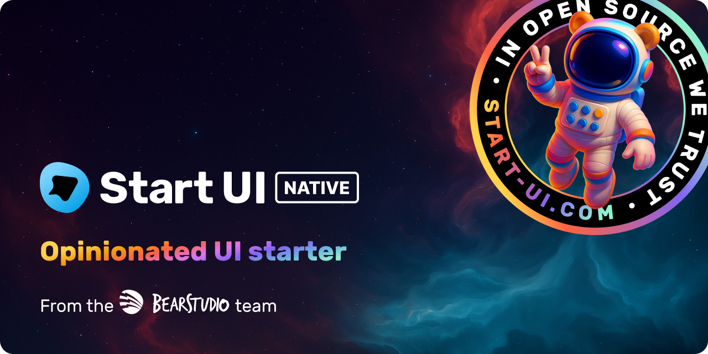

<h1 align="center"></h1>

🚀 Start UI <small>[native]</small> is an opinionated native starter repository created & maintained by the [BearStudio Team](https://www.bearstudio.fr/team) and other contributors.
It represents our team's up-to-date stack that we use when creating native apps for our clients.

# Technologies

[⚙️ Node.js](https://nodejs.org), [🟦 TypeScript](https://www.typescriptlang.org/), [⚛️ React](https://react.dev/), [📱 React Native](https://reactnative.dev/), [🚀 Expo](https://docs.expo.dev/), [🔐 Better Auth](https://www.better-auth.com/), [🖌️ Uniwind](https://uniwind.dev), [🧱 React Native Reusables](https://reactnativereusables.com), [🌴 Tanstack Form](https://tanstack.com/form/), [🌴 Tanstack Query](https://tanstack.com/query/), [👋 Hey API](https://heyapi.dev/)

# Requirements

- [Node.js](https://nodejs.org) >= 22
- [pnpm](https://pnpm.io/)

# Getting Started

```bash
pnpm create start-ui -t native myApp
```

That will scaffold a new folder with the latest version of 🚀 Start UI [native] 🎉

# Installation

```bash
cp .env.example .env # Setup your env variables
cp .vscode/settings.example.json .vscode/settings.json  # (Optionnal) Setup your VS Code
pnpm install # Install dependencies
```

## Environment variables

> [!TIP]  
> Using Expo Go, local development urls should not be `localhost`, use public IP instead

```bash
EXPO_PUBLIC_BASE_URL # Base URL of your server, usefull if you are using Start UI [web]

# OPTIONAL TO OVERRIDE
EXPO_PUBLIC_AUTH_URL # Better-auth url (default `${EXPO_PUBLIC_BASE_URL}/api/auth`)
EXPO_PUBLIC_OPENAPI_URL # OpenAPI contract URL (default `${EXPO_PUBLIC_BASE_URL}/openapi/app/schema`)
```

## API SDK generation

```bash
pnpm gen:api
```

A new folder `/src/lib/hey-api/generated` will be created with stuff like to combine use Tanstack Query to fetch data, based on env variables.

For example

```ts
import { api } from '@/lib/hey-api/api';

useQuery(api.bookGetByIdOptions({ path: { id: props.bookId } }));
```

# Run

### Expo Go

```bash
pnpm dev
```

### Local builds

App name and bundle ID come from `app.config.ts`, evaluated at **prebuild** time. Each script runs `prebuild --clean` with the appropriate `APP_ENV`, then builds.


| Script                                              | App name                    | Build type | Need                                      |
| --------------------------------------------------- | --------------------------- | ---------- | ----------------------------------------- |
| `dev:build:ios` / `dev:build:android`               | Start UI [native] [Dev]     | Dev/Debug  | Local development, replacement of Expo Go |
| `build:staging:ios` / `build:staging:android`       | Start UI [native] [Staging] | Release    | Install staging release version locally   |
| `build:production:ios` / `build:production:android` | Start UI [native]           | Release    | Install production version locally        |


```bash
# Development (debug build, dev client)
pnpm dev:build:ios
pnpm dev:build:android

# Staging (release build, internal testing)
pnpm build:staging:ios
pnpm build:staging:android

# Production (release build, store-like)
pnpm build:production:ios
pnpm build:production:android
```

> [!TIP]
> If the app name is wrong, the native project was generated with the wrong `APP_ENV`. Re-run the same build script — it includes `--clean` to regenerate the native project.

### Devtools

You can use @dev-plugins pressing `Shift + m` in your Expo terminal.

## Storybook

Storybook is managed as a specific mode of the app that is launch apart in port 8083

```bash
pnpm dev:storybook   # To run app in storybook mode
```

> [!TIP]
> You can open Storybook in another tab and switch between the app and Storybook by pressing `i` or `a` in each terminal.

## Generate custom icons components from svg files

Put the custom svg files into the `app/components/icons/svg-sources` folder and then run the following command:

```bash
pnpm gen:icons
```

If you want to use the same set of custom duotone icons that Start UI is already using, checkout
[Phosphor](https://phosphoricons.com/)

> [!WARNING]
> All svg icons should be svg files prefixed by `icon-` (example: `icon-externel-link`) with **square size** and **filled with `#000` color** (will be replaced by `currentColor`).

# GitHub repository configuration

The GitHub Actions workflows require the following configuration.

## Variables

Add at **Settings → Secrets and variables → Actions → Variables**:


| Variable         | Description                                                                          | Used by                                                       |
| ---------------- | ------------------------------------------------------------------------------------ | ------------------------------------------------------------- |
| `API_URL`        | Base URL of your API server                                                          | EAS builds, preview, update, code quality, prepare-production |
| `AUTH_URL`       | Better Auth URL (e.g. `https://your-api.com/api/auth`)                               | EAS builds, preview, update, code quality, prepare-production |
| `OPENAPI_URL`    | OpenAPI schema URL (e.g. `https://your-api.com/openapi/app/schema`)                  | EAS builds, preview, update, code quality, prepare-production |
| `ASC_API_KEY_ID` | App Store Connect API Key ID (e.g. `H3KZ2V5L32`) for the Release Production workflow | prepare-production                                            |


## Secrets

Add at **Settings → Secrets and variables → Actions → Secrets**:


| Secret                      | Description                                                              | Used by                                                           |
| --------------------------- | ------------------------------------------------------------------------ | ----------------------------------------------------------------- |
| `EXPO_TOKEN`                | Expo access token for EAS CLI                                            | EAS build, development build, update, preview, prepare-production |
| `APP_STORE_CONNECT_API_KEY` | Base64-encoded App Store Connect API key (.p8 file) for store submission | prepare-production                                                |


Create an Expo token at [expo.dev/accounts/{account}/settings/access-tokens](https://expo.dev/accounts/_/settings/access-tokens).

For `APP_STORE_CONNECT_API_KEY`: export your App Store Connect API key as base64 (`base64 -i AuthKey_XXX.p8`) and store the result as the secret. The prepare-production workflow decodes it at runtime for `eas submit`.

For the **Release Production** workflow, also configure `eas.json` submit.production with your App Store Connect credentials (`ascAppId`, `ascApiKeyId`, `ascApiKeyIssuerId`, `ascApiKeyPath`), and set the `ASC_API_KEY_ID` variable to match your key ID (used in the key filename).

## Workflows


| Workflow                  | Trigger      | Description                                                                             |
| ------------------------- | ------------ | --------------------------------------------------------------------------------------- |
| **EAS build**             | Manual       | Build app — select profile (development, staging, production) in the GitHub UI          |
| **EAS Development build** | Manual       | Build development client (internal)                                                     |
| **EAS Update**            | Manual       | Publish OTA update — select channel (development, staging, production) in the GitHub UI |
| **EAS Preview**           | Pull request | Publish preview update on PR branch                                                     |
| **Release Production**    | Manual       | Build production, then submit to App Store and Play Store                               |


### EAS build profiles


| Profile         | Purpose                                                                  |
| --------------- | ------------------------------------------------------------------------ |
| **development** | Dev client for local development (internal distribution)                 |
| **staging**     | Internal distribution for testers (never sent to stores)                 |
| **production**  | Store build (auto-increments, submitted via Release Production workflow) |


# EAS Preview

To be able to use previews on PR, you have to setup your project with EAS

1. Configure [GitHub variables and secrets](#github-repository-configuration) (see above)
2. Setup Expo project: [https://expo.dev/](https://expo.dev/)
  - Create your project
    - Get project's id
    - Set as `EAS_PROJECT_ID` in `app.config.ts`
3. Setup eas
  - `eas login`
    - `eas init --id {projectid}`
    - `eas update:configure`

